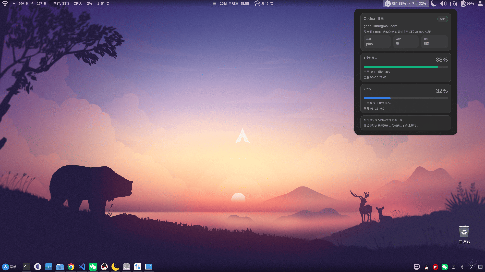

# Usage Deck for Cinnamon

[English](./README.md)

`Usage Deck` 是一个 Cinnamon 面板插件，用来聚合查看多个 provider 的用量、额度和余额信息。

它可以同时展示内置 provider，例如 `Codex`、`GitHub Copilot`、`z.ai`、`DeepSeek`、`OpenCode Go`，也支持从本地配置目录加载用户自定义 provider。



## 功能

- 在面板中显示各 provider 提供的摘要信息
- 在 tooltip 和 popup 中显示 provider 详情
- 支持通过右键菜单启用或关闭 provider
- 按固定频率自动刷新
- 同时支持内置 provider 和用户自定义 provider

## 依赖

- Cinnamon
- `python3`
- 具体依赖取决于你启用了哪些 provider

例如：

- `Codex`：需要 `codex` CLI 且已登录
- `GitHub Copilot`：需要 `gh` CLI 且账号具备 Copilot 权限
- `z.ai`：需要 `Z_AI_API_KEY`
- `DeepSeek`：需要 `DEEPSEEK_API_KEY`
- `OpenCode Go`：需要 `OPENCODE_GO_WORKSPACE_ID` 和 `OPENCODE_GO_AUTH_COOKIE`

## 安装

方式 1：

```bash
./install.sh
```

安装脚本会通过 Cinnamon D-Bus 自动重载 applet。

方式 2：

```bash
mkdir -p ~/.local/share/cinnamon/applets
cp -r codex-usage@geequlim ~/.local/share/cinnamon/applets/
chmod +x ~/.local/share/cinnamon/applets/codex-usage@geequlim/providers/*/fetch_usage.py
```

使用方式 2 时，需要手动重载 Cinnamon：

- X11：`Alt+F2`，输入 `r`
- Wayland：注销并重新登录

最后在 Cinnamon 的 Applets 设置里添加 `Usage Deck`。

## 配置

右键点击 applet 可以：

- 立即刷新
- 启用或关闭 provider

当前 Cinnamon 设置页只暴露宿主级的刷新频率。

## 环境变量

如果桌面会话没有继承 shell 环境变量，建议写到：

- `~/.config/environment.d/*.conf`
- 或 `~/.config/codex-usage/env`

常见示例：

```ini
Z_AI_API_KEY=你的 z.ai key
DEEPSEEK_API_KEY=你的 DeepSeek key
OPENCODE_GO_WORKSPACE_ID=你的 workspace id
OPENCODE_GO_AUTH_COOKIE=你的 cookie
HTTP_PROXY=http://127.0.0.1:1080
HTTPS_PROXY=http://127.0.0.1:1080
ALL_PROXY=socks5://127.0.0.1:1080
```

## 用户自定义 Provider

内置 provider 位于：

- `codex-usage@geequlim/providers/`

用户自定义 provider 可以放到：

- `~/.config/usage-deck/providers/`

如果用户 provider 和内置 provider 使用相同的 `id`，则用户 provider 会覆盖内置 provider。

## 项目结构

```text
codex-usage@geequlim/
  applet.js
  icon.png
  stylesheet.css
  metadata.json
  settings-schema.json
  bin/
    runtime_env.py
  lib/
    ...
  providers/
    ...
```

## 说明

- provider 数据依赖外部服务是否可用
- `install.sh` 会自动重载 applet；直接修改源码后仍需重载
- 用户自定义 provider 会执行本地代码，应视为受信任代码
